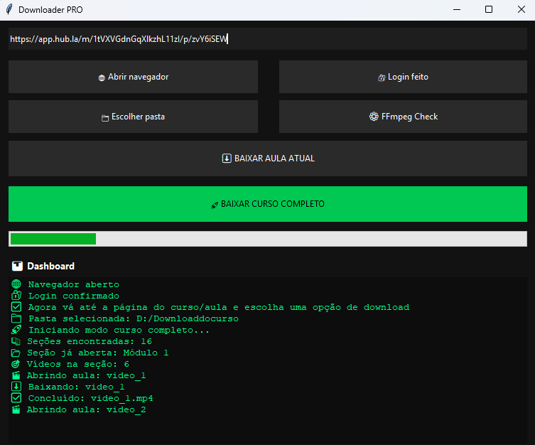

# 🚀 Course Video Downloader PRO

<p align="center">
  
  
  
  
</p>

<p align="center"><b>Downloader inteligente para plataformas de cursos online</b></p>


## 📌 Sobre o Projeto

Aplicação desktop em Python para automatizar downloads de cursos online usando Selenium + FFmpeg.

### Recursos principais

* Login manual seguro
* Navegação automática por módulos
* Detecção de vídeos reais
* Suporte a .mp4 e .m3u8
* Download de curso completo
* Interface estilo IDM
* Logs em tempo real


## 🖼️ Screenshot do Aplicativo

<p align="left">
  
</p>


## ⚙️ Tecnologias Utilizadas

* Python
* Tkinter
* Selenium
* ChromeDriver
* FFmpeg
* Threading


## ⬇️ Baixar Aplicativo

👉 Clique abaixo para baixar a versão mais recente:

[⬇️ Download Instalador](https://github.com/PedroHMDosSantos/Course-Video-Downloader/releases/download/v2.0/Cuser.Video.Dowloader-setup.exe)


## 📦 Instalação

1. Baixe o instalador
2. Execute o arquivo .exe
3. Siga o passo a passo
4. Pronto 🚀

### ⚠️ Aviso

O Windows pode exibir um alerta de segurança.
Clique em **Mais informações** → **Executar assim mesmo**.


## ⬇️ Como Usar 

1. Cole a URL do curso
2. Clique em Abrir Navegador
3. Faça login manualmente
4. Navegue até o curso desejado
5. Entre exatamente na página onde estão os vídeos
6. Abra o primeiro vídeo da lista
7. Volte ao aplicativo e escolha a pasta destino
8. Clique em Baixar Curso Completo
9. O sistema irá abrir os capítulos automaticamente e baixar os vídeos em sequência


## 📂 Estrutura

```text
app/
 ├── core/
 ├── ui/
 ├── main.py
run.py
README.md
requirements.txt
```


## 💻 Instalação para Desenvolvedores

```bash
git clone https://github.com/PedroHMDosSantos/Course-Video-Downloader.git
cd Course-Video-Downloader
pip install -r requirements.txt
python run.py
```


## ⭐ Apoie o Projeto

Se curtiu, deixe uma estrela no repositório.
